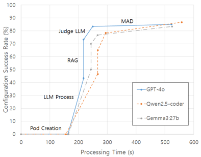

# LLM-Based AI Agent for Automated VNF/CNF Configuration

This repository contains an **LLM-based AI agent for automating VNF/CNF deployment** in NFV environments.  
The system takes user-provided **MOPs (Method of Procedure)** as input and generates automated configuration workflows (Python / Ansible) using an LLM.  
Before applying any generated configuration to the real network, the code is validated inside an **NDT (Network Digital Twin)** environment.  
Only configurations that **successfully pass NDT verification** are returned to the user.

If the generated configuration fails during execution, the system monitors errors and allows the LLM to iteratively fix them using experimental techniques such as **RAG**, **MAD**, and **RL**.

Below is an example result showing improved configuration success rates across several LLMs relative to module execution time:



This work is currently being written as a research paper.  
A preliminary version covering OpenStack-based experiments has been published.

---

## 📌 System Architecture

### Requriements:
```bash
pip install paramiko python-openstackclient python-docx ansible_runner astor torch pytz tqdm kubernetes trl datasets peft bitsandbytes
 ```

The current prototype consists of the following major modules:

- **LLM Module** – Generates workflow code based on user-provided MOPs  
- **Test Module** – Executes and validates generated workflows  
- **NDT (Network Digital Twin)** – Supports Kubernetes and OpenStack environments  
- **RAG Module** – Knowledge-enhanced LLM support (KB crawling, embedding fine-tuning, I/O filtering)  
- **MAD Module** – Self-healing improvements (experimental)  
- **RL Module** – Reinforcement learning integration (in development)  

---

## 📁 Directory Structure and Key Files

The core AI Agent code is located in `llm_based_config/`.  
Each component is described below:

### **Core Agent**
- **main.py**  
  Main AI agent logic and workflow orchestrator.

### **OpenStack Interaction**
- **make_new_floating_ip.py**  
- **openstack_config.py**  
  Libraries for communicating with and manipulating OpenStack resources.

### **MAD Module**
- **mad.py**  
  Implements MAD-based self-correction logic (currently unused).

### **RAG Module**
Directory: `RAG/`  
Includes:
- Knowledge base crawling scripts  
- Word embedding fine-tuning code  
- Input/output filtering logic  
This is one of the core components under active research and paper preparation.

### **Prompting**
- **prompt.py**  
  Prompt templates used for requesting configuration generation from LLMs.

### **Workflow Preparation**
- **python_code_modify.py**  
  Pre-test processing for Python-generated workflows before applying them to the Test Module.

### **Fine-Tuning & RL (In Development)**
- **LLM_Finetuning.py**  
  LLM fine-tuning library.
- **RL_LLM.py**  
  Reinforcement learning framework built on top of `LLM_Finetuning.py`.

---

## 📄 Additional Directories

- **MOP/**  
  Contains the MOPs used in experiments.

- **data_generating/**  
  Scripts to automatically generate MOPs using GPT-based generation pipelines.

---

## 📫 Contact

For inquiries related to this project, please contact:  
📧 **obiwan96@postech.ac.kr**

---

## 📝 Citation

If you wish to cite this research, please reference the following paper (supported by **Samsung Electronics Co., Ltd.**):

> S. Nam, N. Van Tu and J. W. -K. Hong,  
> **"LLM-Based AI Agent for VNF Deployment in OpenStack Environment,"**  
> *NOMS 2025-2025 IEEE Network Operations and Management Symposium*, Honolulu, HI, USA, 2025, pp. 1-7.  
> doi: 10.1109/NOMS57970.2025.11073607.

**Paper Link:** https://ieeexplore.ieee.org/abstract/document/11073607
